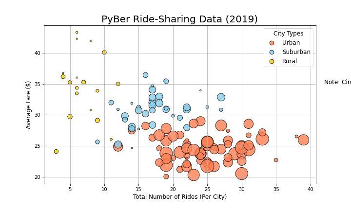

# Pyber_Analysis

## Overview Of Project
The point of the original was to compare the ride fares for different types of cities as well as the amount of drivers and the number of rides taken. For the second part of the project the fare comparison for certain months needed to be displayed in a line chart with all three city types. 

## Results 

% of Rides                        |  Ride count data
:-------------------------:|:-------------------------:
  |  

- Urban cities have more rides than suburban and rural combined

% of Fares                 |  Ride Fare Data
:-------------------------:|:-------------------------:
  |  

- Average fare in rural cities are $11 higher than urban cities yet urban cities still make up the majority of the fares when totaled

% of drivers                 |  Drive count data
:-------------------------:|:-------------------------:
  |  

- Rural cities have the least amount of drivers. 

Ride sharing Data               |  Total Fare by City Type
:-------------------------:|:-------------------------:
  |  
- Towards the end of Febuary there is a spike in fare costs for all cities but urban cities have a few different spikes throughput the time. 
## Summary

The main disperity between the city types is that Urban cities bring in the most revenue all while having the lowest cost rides. Rural cities average fare are the highest and they bring in the least revenue. More research should be done on why people in rural areas are less likely to ride and also work as drivers. Something like offering discounts since rides in these area tend to be more expensive, could attract more people. 

Looking at the bubble chart, there could be a correlation between driver count and revenue. One question to ask is if riders in rural cities are waiting longer for their rides because there are less drivers available, therefore they are less likely to request rides?

Might also be useful to figure out why urban cities fare spikes a few different times and why the other cities stay more consistent.
